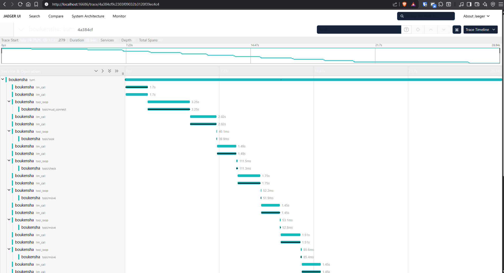
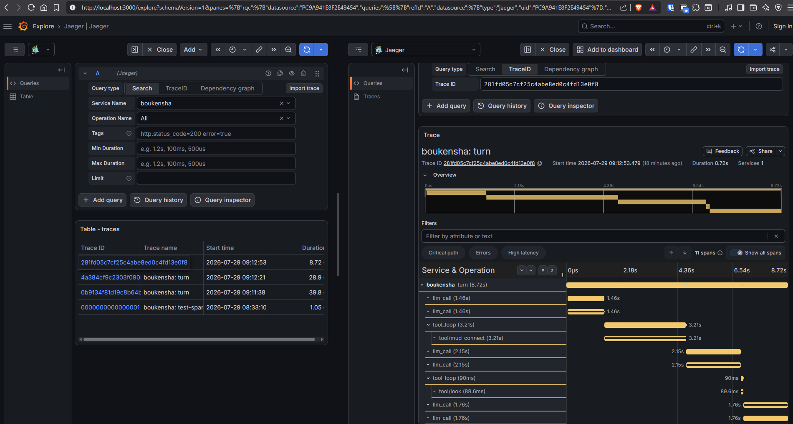
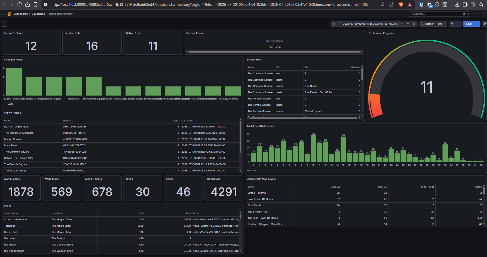
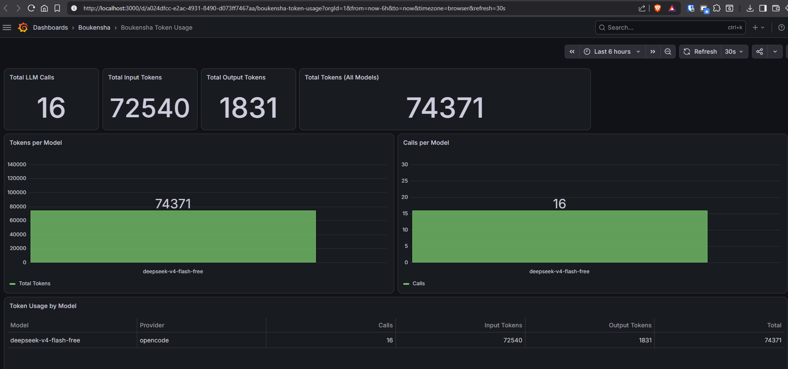
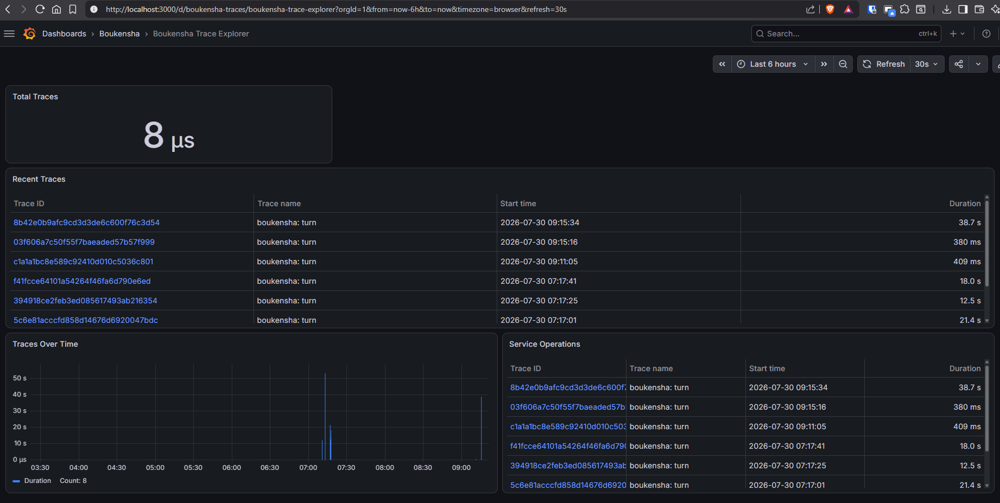

## Technical Goal

For Week 2, the goal is really to add three capabilities to the Boukensha agent framework:
1. **Observability layer** — para makita natin yung internal span tree ng agent in Jaeger
2. **Basic memory** — so that the agent state persists across sessions
3. **Optimize token usage** — para hindi masyadong malaki yung token consumption

The observability layer is done already: `BOUKENSHA_OTEL_ENABLED=true` pushes spans to `localhost:4318/v1/traces`, and traces appear in both Jaeger UI (port 16686) and Grafana Trace Explorer (port 3000, Jaeger datasource).

## Technical Uncertainty

Actually, the thing is I wasn't sure if the Boukensha agent framework's tracing pipeline really worked end-to-end. The env var `BOUKENSHA_OTEL_ENABLED=true` was set but the problem was I never really verified that traces reached Jaeger. The MUD daemon — that's the Ruby TCP proxy that connects the Python agent to CircleMUD — also had to be started manually every time. That was easy to forget and it caused confusing crashes.

The Deepseek V4 Flash model which is the default provider for this project, it struggled to reason about the bug. Like it couldn't connect the dots between the disconnected subsystems — the daemon lifecycle, socket timeouts, the OTEL wiring. So what I did was I switched to the Big Pickle model and that one immediately identified the root causes.

## Technical Observations

### Problem 1: MUD daemon was not auto-starting

So `nav_bench` and `move_player_to_start_room`, both of them checked if the daemon was running via `admin_connected()`. But the thing is they never actually started it. So if the daemon was down, the entire benchmark would crash with `ConnectionRefusedError` because of the stale daemon port files.

**Fix** (`week2_capable/bin/nav_bench`, `week2_capable/bin/move_player_to_start_room`): Both scripts now ping the daemon first through a lightweight Python check before running. If it's unreachable, they delete the stale port file and then spawn `ruby mud_daemon.rb` in the background, and wait for the port file to appear before proceeding.

### Problem 2: Jaeger traces were not arriving

What happened here was the tracer was created in `boukensha.run()` (line 155 of `__init__.py`) but it was never wired to the Agent constructor. The Agent class has a `tracer=` parameter, but `run()` simply didn't pass it. So that meant `agent._trace()` always returned a `_NullSpanContext` — so all span creation was silently no-oped. The `tracer.finish()` ran in the `finally` block and called `flush()`, but `self._batches` was always empty.

One thing I noticed also, the `repl()` function in the same file correctly passed `tracer=tracer` to the Repl constructor. So it was just an oversight in `run()`.

**Fix** (`week1_baseline/python/12_context/boukensha/__init__.py`): Added `tracer=tracer` to the Agent constructor call.

### Problem 3: Socket timeout was too short for MUD login

The `mud_client.py` used `socket.create_connection(..., timeout=10)` with a single 10-second timeout that applied to both TCP connection and the subsequent `recv()`. The issue is the Ruby daemon's `handle_connect` calls `MudManager::Session.login()` which does up to 4 sequential `read_until` calls, each with a 10-second timeout. So total login could take 30-40 seconds, which caused Python's `recv()` to time out.

**Fix** (`week1_baseline/python/12_context/boukensha/tools/mud_client.py`): We split it into a 5-second connection timeout and a 20-second `sock.settimeout()` for the response read.

### Problem 4: Stale port file crash in player reset

The thing with `reset_player_to_start()` was it called `stale.disconnect()` unconditionally. So it would throw `ConnectionRefusedError` if the daemon wasn't running. The auto-start fix made this less likely but the code should still be defensive.

**Fix** (`week2_capable/02_automatic_resets/player_reset.py`): We check `PORT_FILE.is_file()` before creating the client, and we wrap the disconnect in a try/except.

### Problem 5: OTEL status code was inverted

So `opentelemetry.py` set `"code": 0 if span.status == "error" else 1`. But according to the OTLP spec, 0 is UNSET, 1 is OK, and 2 is ERROR. So error spans were being marked as UNSET instead of ERROR. That's why the traces were not showing the right status.

**Fix** (`week1_baseline/python/12_context/boukensha/opentelemetry.py`): Changed to `"code": 2 if span.status == "error" else 1`.

## Technical Conclusions

The tracing pipeline now works end-to-end. Jaeger UI shows span trees for each benchmark run, and Grafana's Trace Explorer with the Jaeger datasource selected and the "boukensha" service queried shows the same traces. The MUD daemon auto-starts reliably so the benchmark doesn't crash anymore on the first run.

The pattern across all these issues was consistent: the framework had all the right pieces — tracer creation, exporter, agent hook points — but a single missing parameter in the constructor call broke the whole observability chain.

---

## Basic Memory (SQLite-backed persistence)

So the agent persists its exploration state to a SQLite database (`memory_bench.db`) through `MemoryStore`. On each `look` or `move`, the hooks record rooms, exits, entities, and player position into tables:

- **rooms** — room id, name, visit count, last seen
- **exits** — from/to room, direction, whether walked or not
- **entities** — mobs and objects seen per room
- **player_state** — current room and frontier exits
- **token_usage** — per-model token counters with input/output tokens and duration

For room inspection, there's a three-step survey protocol that's encoded in the system prompt (`prompts/system.md`): `look` → `exits` → `consider`. The `after_tool` hook in `memory_hook.py` parses the room output using regex. It handles both CircleMUD's `[ Exits: s ]` format and also the more common `Obvious exits:` format.

### World data integration

The parsed CircleMUD world files (`.wld`, `.mob`, `.obj`, `.zon`, `.shp`) are loaded into dedicated world tables via `load_world_data.py`, which uses the `circlemud-world-parser` package at `week0_explore/`. This gives the agent awareness of the full map without needing to explore every room one by one:

| Table | Rows |
|-------|------|
| `world_rooms` | 1,878 |
| `world_exits` | 4,291 |
| `world_mobs` | 569 |
| `world_objects` | 678 |
| `world_zones` | 30 |
| `world_shops` | 46 |

Query methods like `world_route_to()` and `world_mobs_for_zone()` let the agent find paths and evaluate combat risks by zone level range.

---

## Grafana Dashboards (3 dashboards provisioned)

Three Grafana dashboards are auto-provisioned from JSON files in `week2_capable/grafana/dashboards-json/`. They all use the Infinity datasource (`yesoreyeram-infinity-datasource`) to query the memory server at `host.docker.internal:9876`:

### 1. Memory Dashboard

This one shows the exploration state: rooms explored, walked vs. frontier exits, visits per room bar chart, a known rooms table, and an exploration progress gauge. At the bottom section, it shows world data: room/mob/object/zone/shop/exits stat counters, mob level distribution bar chart, zones table with level ranges, and shops table.

### 2. Token Usage Dashboard

Shows per-model LLM token consumption: total calls, input/output tokens, tokens per model bar chart, calls per model bar chart, and a detail table grouped by model and provider.

### 3. Trace Explorer Dashboard

This one uses the Jaeger datasource to surface OpenTelemetry traces from the benchmark runs. It shows span timelines and the service graph.

---

## Token Usage Tracking

The `after_model` hook in `navigation.py` captures the LLM usage from each model response and calls `store.record_token_usage(model, provider, input_tokens, output_tokens)`. The hook handles both naming conventions — `prompt_tokens` vs `input_tokens`, `completion_tokens` vs `output_tokens`. The memory server exposes a `/token-usage` endpoint that aggregates by model and provider and returns the calls, totals, and duration.

---

## Key Takeaways

1. **Traces don't flow just because you create a tracer** — you really need to inject it into the agent.
2. **Memory bridges sessions** — without persistence, the agent starts blank every time. The SQLite-backed store gives continuity across moves and even across server restarts.
3. **World data adds context without exploration cost** — loading the parsed map lets the agent plan routes and assess danger before stepping into a zone.
4. **Three dashboards, one pipeline** — the Infinity datasource in Grafana queries the memory server for exploration stats, world data, and token usage, while Jaeger provides the trace-level observability.
